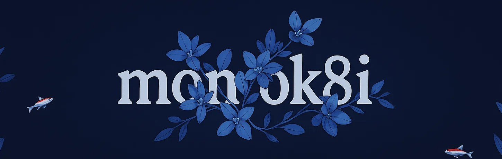

<h1 align="center"> Hi there, I'm Yurii 👋 </h1>

   🇺🇦 <i> Python enthusiast from Ukraine diving into backend development.. </i> 

<h2 align="center"> About Me 🦋 </h2>

  

    
    I am a young developer who is always looking for opportunities for development and is not afraid of difficult tasks. In the world of code, I am like an artist with a brush, but instead of paints - syntax and logic.
    I like to understand complex things, experiment with new technologies and create something of my own.
    
  

  

    
    I believe that every day is a new level of the game called "life", where you can try something new, discuss ideas with like-minded people, or just sit with code in silence.
    Sometimes my work environment looks like a laboratory of experiments - with microservices, bots, Linux settings and customizations.
    
  

  

    <i> Life motto: never stop at what you've achieved, because the world of IT is an endless adventure 🦋 </i> 
  

<h2 align="center"> My Tech stack </h2>

  <table>
    <tr>
      <th>Languages</th>
      <td></td>
    </tr>
    <tr>
      <th>Frameworks</th>
      <td></td>
      <td></td>
      <td></td>
    </tr>
    <tr>
      <th>Databases</th>
      <td></td>
      <td></td>
    </tr>
    <tr>
      <th>Brokers and task managers</th>
      <td></td>
      <td></td>
    </tr>
    <tr>
      <th>Containerization</th>
      <td></td>
    </tr>
    <tr>
      <th>Other tools</th>
      <td></td>
      <td></td>
      <td></td>
      <td></td>
    </tr>
    <tr>
      <th>Interested for</th>
      <td></td>
      <td></td>
  </table>

<!-- -  **Python is my main programming language.**
-  **I am also interested in the Rust and C++ programming languages**
-  **I'm passionate about backend web development and currently taking steps in this direction.**
- 🛠️ My current tech stack includes:
  - Developing Telegram bots using the **Aiogram** framework.
  - Initial development of backend structures for websites using  **FastAPI** and  **Litestar** frameworks.
  - Working with databases  **PostgreSQL** and  **Redis**.
  - Basic knowledge of message broker   **RabbitMQ** and task manager 🥦 **Celery**.
  - Proficient in  **Docker** for containerizing my applications.
- 🖥️ I code in VSCode & PyCharm apps. -->

## My GitHub statistic:

 

## Contact
- 📫 **[My email](yurii.didkivskyi@proton.me)**
- 🦋 **[GitHub as @monok8i (you are here)](https://github.com/monok8i).**

> Feel free to visit me on GitHub to check out my projects and leave your feedback. Thanks for stopping by! 😊
