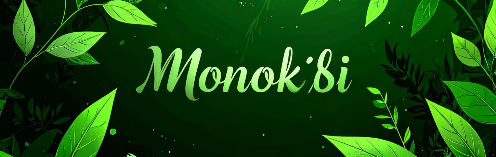

<!--

---
-->

# 🐍 Yurii

I'm a young developer from Ukraine who is always looking for opportunities to grow. Design has never been my thing, but in the world of code I'm like an artist with a brush, but instead of paints - syntax and logic.
I like to understand complex things, dive headlong into code and complex logic, experiment with new technologies and create something of my own.

---

## 📨 Contact me

  <a href="https://www.github.com/monok8i" target="_blank">
    <picture>
      <source media="(prefers-color-scheme: dark)" srcset="https://raw.githubusercontent.com/danielcranney/readme-generator/main/public/icons/socials/github.svg" />
      <source media="(prefers-color-scheme: light)" srcset="https://raw.githubusercontent.com/danielcranney/readme-generator/main/public/icons/socials/github.svg" />
      
    </picture>
  </a>
  <a href="https://www.gitlab.com/monok8i" target="_blank">
    <picture> <source media="(prefers-color-scheme: dark)" srcset="https://cdn.jsdelivr.net/gh/devicons/devicon@latest/icons/gitlab/gitlab-original.svg" />
      <source media="(prefers-color-scheme: light)" srcset="https://cdn.jsdelivr.net/gh/devicons/devicon@latest/icons/gitlab/gitlab-original.svg" />
      
    </picture>
  </a>
  <a href="http://www.instagram.com/monok8i" target="_blank">
    <picture>
      <source media="(prefers-color-scheme: dark)" srcset="https://raw.githubusercontent.com/danielcranney/readme-generator/main/public/icons/socials/instagram-dark.svg" />
      <source media="(prefers-color-scheme: light)" srcset="https://raw.githubusercontent.com/danielcranney/readme-generator/main/public/icons/socials/instagram.svg" />
      
    </picture>
  </a>

---

## 🚀 What I Build With

### ⇒ Programming Languages:

  
  
  

### ⇒ Databases & Caches:

  
  
  
  

### ⇒ Backend Frameworks:

  
  

### ⇒ Frontend:

  
  
  

### ⇒ Messaging & Integrations:

  
  

### ⇒ Tools & DevOps:

  
  
  
  

### ⇒ Environment & Editors:

  
  
  

---

---

> Feel free to visit me on GitHub to check out my projects and leave your feedback. Thanks for stopping by! 😊
